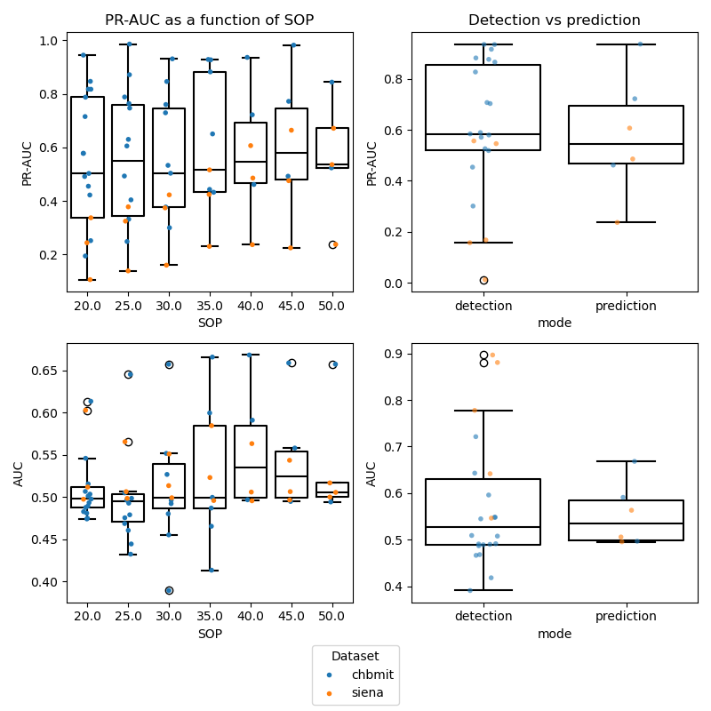

## Bids Derivatives for seizure prediction problems

In this project  patient specific logistic regression classifiers are used to either detect or
predict epileptic seizures with different occurrence periods in advance. 
Patient scalp EEG from to commonly used BIDS available databases, Siena and CHB_MIT 

### Directory overview

### Patient selection

In this work only subjects (patients) with six or more annotated seizures are considered
This is done to ensure a sufficient number of three training seizures and at least three test seizures.

### Feature calculation

The project contains a function (see: `./feature_extraction/linear_features.py`)
to extract 59 univariate linear EEG features per channel. 
They are a mix of time, and frequency domain features used in 
previous EEG studies explained in https://doi.org/10.1002/epi4.12748

#### Feature storage

All raw features are saved back into the BIDS Database in a BIDS derivate called  _linear_features_ 
as .npy numpy arrays for convieniece

### Data labelling

To distinguish between the two tasks 
1 detection , 2 prediction , another derivative seizures_pred is created 
which contains multiple .npy files of true labels for different types of problems detection windows, SPHs, SOPs can be
described

### Files

`main_create_features_labels.py`

selects patients for study based on constraints (number of seizures), calculates features and labels for different tasks
and saves them as derivatives

`main_run_classifiers.py`

creates pseudoprospective train-test splits, trains and tests (evaluates) a set of classifiers for a given task.

### Results

#### Main files
These files are the ones you execute:

#### Function files

The machine learning code and may of the pricples of this project where inspired by  
Costa, G., Teixeira, C. & Pinto, M.F. Comparison between epileptic seizure prediction and forecasting based on machine learning. Sci Rep 14, 5653 (2024). https://doi.org/10.1038/s41598-024-56019-z

## Please cite this work as:
