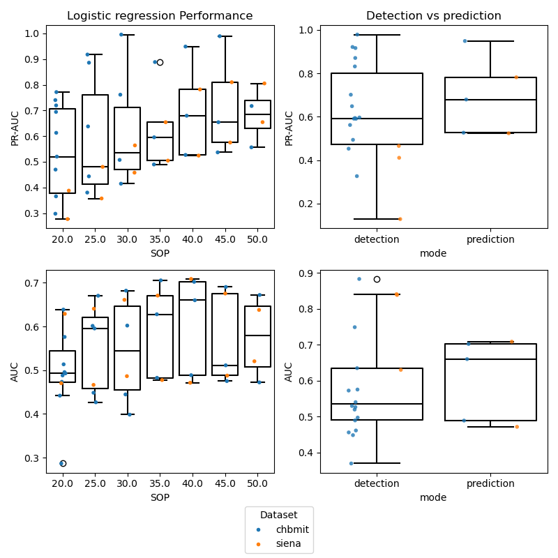

# Report for the Epilepsy Prediction and Detection Project
Effective siezure prediction and fair comparision between models and patients is a complex endevour.

## Goals

1. The primary goal of the project was to compare the influence of the duration of the seizure occurence period on the  
the prediction accuracy across patient specific models from two databases.

2. The other focus of the project was to build a more robust, reproducible and performant end to end ML pipeline, mainly by leveraging the 
BIDS data structure and the possibility to store database derivatives and Multiprocessing for ML training.

## Preliminary Results

PR_ AUC and AUC as a function of SOP

Using the first three seizures as training set

Top: left PR-AUC vs SOP ; right: detection vs Prediction performance, prediction is for SOP of 40 min.
Bottom: left AUC vs SOP right: detection vs Prediction performance, prediction is for SOP of 40 min.;

## Missing Pieces/Bugs/potential issues

- Elongation of the seizure occurence period (**SOP**) resulted in unforeseen issues for many patient timeseries
  - this lead to the loss of subjects in the highter SOP, due to the deletion of interictal 
- SIENA pat id 10 and 14 showed NaNs in the feature matrix 
  - While percentage of NaNs was very low (< 0.01%) this still hints to a problem with the feature calculation function
  - At this time NAN values where just replaced by the value 0.5 
- The EEG Data was bandpass filtered from 1 to 40Hz at a _per file level_ before concatination this could introduce some form of bias
- No re-referencing to the average montage nor any other preprocessing (artefact removal) was performed

## Discussion

We see an expected increase in AUC and PR AUC with larger SOP. 
A SOP of 40 minutes seems to perform best for Logistic regression on the datasets under study.
Th number of patients that are tested decreases with increasing SOP duration, since the train dataset gets "cut"; 
resulting in too little seizure events to test.

## Next Steps

- Event based statistics Seizure SS; FPR/h , Firing Power method! 
- more classifiers to compare 
  - Ensemble: ExtraTreesClassifier; SVM ; CNN
  
- Feature importance analysis using SHAP (Shapley Additive Explanations) 
  - for patient specific models
  - dissect, which type of feature form where (ie which 10-20 electrode) predicts preictal phases the best

- BIDS derivatives needs at least a JSON sidecar to be compliant
- Time plots of emitted warnings for explanatory visualisation of the SOP, SPH etc
- writing a test suite to have 100% insurance on the correctness of label and feature creation.

